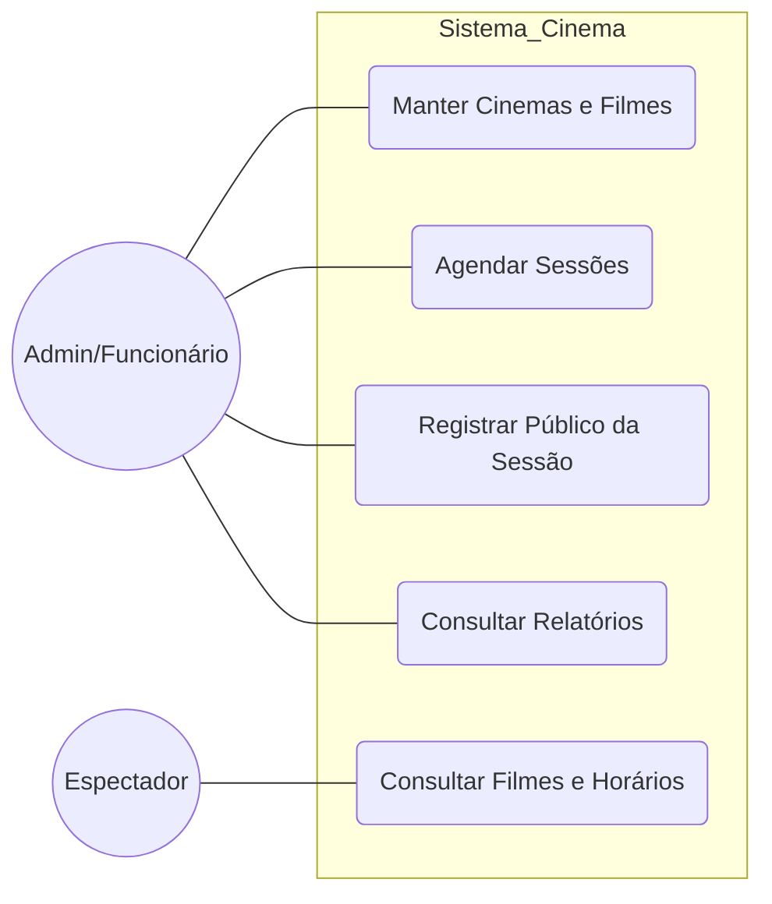
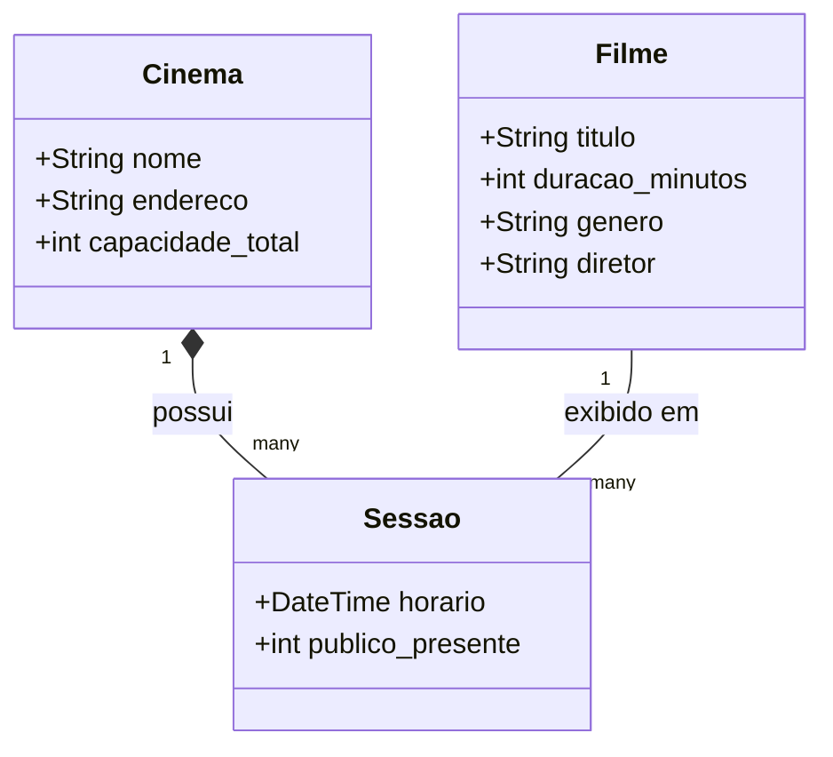
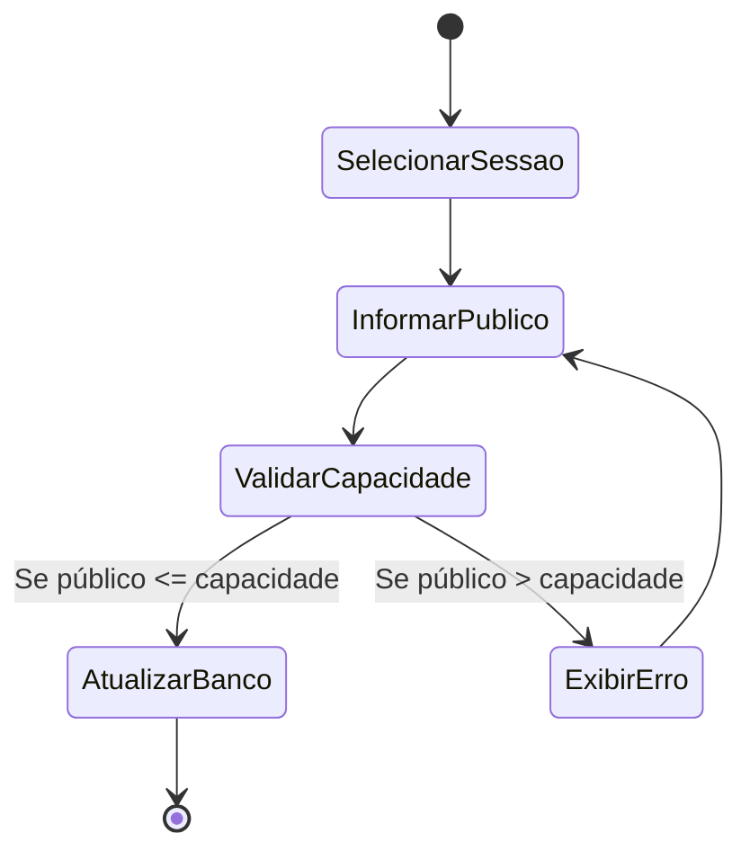

# Modelagem UML - Rede de Cinemas

## A. Diagrama de Casos de Uso

```mermaid
graph LR
    subgraph Sistema_Cinema
        UC1(Manter Cinemas e Filmes)
        UC2(Agendar Sessões)
        UC3(Registrar Público da Sessão)
        UC4(Consultar Relatórios)
        UC5(Consultar Filmes e Horários)
    end

    Admin((Admin/Funcionário)) --- UC1
    Admin --- UC2
    Admin --- UC3
    Admin --- UC4

    Esp((Espectador)) --- UC5

```

## B. Diagrama de Classes do Domínio


```mermaid
classDiagram
    Cinema "1" *-- "many" Sessao : possui
    Filme "1" -- "many" Sessao : exibido em
    
    class Cinema {
        +String nome
        +String endereco
        +int capacidade_total
    }
    
    class Filme {
        +String titulo
        +int duracao_minutos
        +String genero
        +String diretor
    }
    
    class Sessao {
        +DateTime horario
        +int publico_presente
    }

```

## C. Diagrama de Atividade (Registrar Público)


```mermaid
stateDiagram-v2
    [*] --> SelecionarSessao
    SelecionarSessao --> InformarPublico
    InformarPublico --> ValidarCapacidade
    state ValidarCapacidade <<choice>>
    ValidarCapacidade --> AtualizarBanco : Se público <= capacidade
    ValidarCapacidade --> ExibirErro : Se público > capacidade
    ExibirErro --> InformarPublico
    AtualizarBanco --> [*]

```

```

