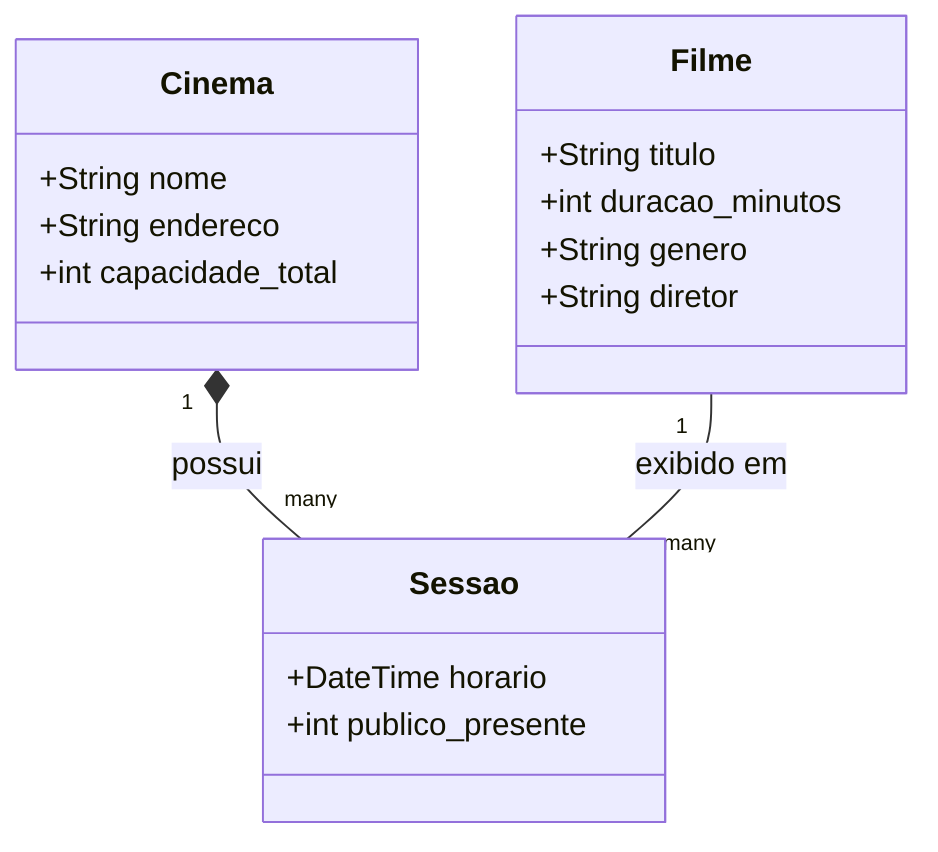
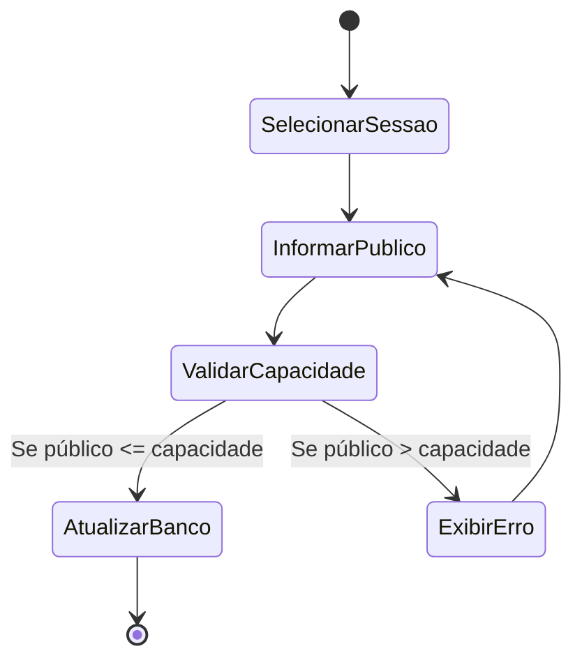
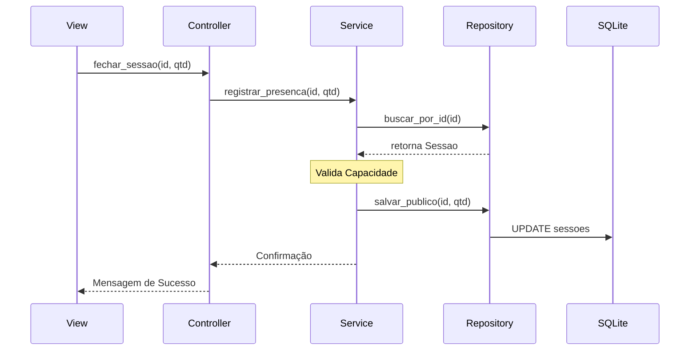

```markdown
# Modelagem UML - Rede de Cinemas

## A. Diagrama de Casos de Uso
```mermaid
useCaseDiagram
    actor "Administrador / Funcionário" as Admin
    actor "Espectador" as Esp
    
    Admin --> (Manter Cinemas e Filmes)
    Admin --> (Agendar Sessões)
    Admin --> (Registrar Público da Sessão)
    Admin --> (Consultar Relatórios)
    
    Esp --> (Consultar Filmes e Horários)

```

## B. Diagrama de Classes do Domínio



## C. Diagrama de Atividade (Registrar Público)



## D. Diagrama de Sequência (Fluxo de Dados)



```

---

### 2. No arquivo `README.md` (na raiz do projeto)
Este é o arquivo que o professor vai ver primeiro ao abrir o seu GitHub. Ele explica a arquitetura.

**Cole este conteúdo lá:**

```markdown
# 🎬 Sistema de Gestão - Rede de Cinemas

Projeto de Engenharia de Software para controle de filmes, sessões e público.

## 🏗️ Arquitetura
O sistema utiliza o padrão **MVC + Service + Repository** para garantir a separação de responsabilidades:
- **Models**: Representação dos dados.
- **Repositories**: Manipulação do banco SQLite.
- **Services**: Onde as Regras de Negócio (ex: limite de capacidade) são validadas.
- **Controllers**: Gerenciamento do fluxo de entrada e saída.

## 🚀 Como Executar
1. Entre na pasta `src`.
2. Execute `python main.py`.

```

---
